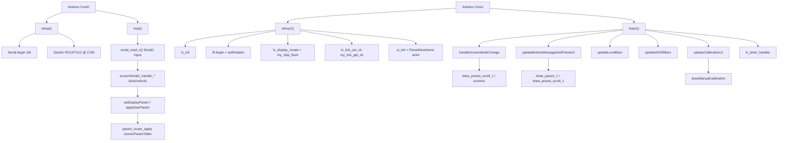

# RP2040_SCREEN_CONTROLLER_LVGL_LOVEYANGFX File Index

Purpose of **every file**, and for each source function: **what it does**, **who calls it**, and **when**.

Scope: **sketch folder root** sources + `docs/`. Vendored `fela_U8g2/` and `src/felanew_U8g2/` are summarized only (unused/legacy).

> `params_def.h`, `param_router.h`, `serial_input_protocol.h`,
> `serial_param_protocol.h`, `serial_frame.h` and `serial_parser.h` are no longer
> files in this folder. They come from the shared
> [`DCO-PROTOCOL`](../../../DCO-PROTOCOL/README.md) library, symlinked in as
> `SCREEN-CONTROLLER/libraries/DCO-PROTOCOL`. Their entries below still describe
> the code this board compiles; edit them in the library, once, for every board.

- Deep narrative: [`REFERENCE_AI.md`](REFERENCE_AI.md)
- UI / serial protocol: [`UI_AND_SERIAL.md`](UI_AND_SERIAL.md)
- Display / pin map: [`HARDWARE.md`](HARDWARE.md)
- Three-board topology: [`SYSTEM_OVERVIEW.md`](SYSTEM_OVERVIEW.md) (stub → DCO canonical)
- Repo entry / doc index: [`../README.md`](../README.md)

Headers with no bodies are marked **no function definitions**.
**Dead** = no live callers. **Unreachable** = call site exists but cannot run as currently gated. **`#ifdef` gated** = compiled only when the flag is set. **commented-out** = body fully commented (not compiled).

MCU: **RP2040** (dual Arduino cores). Screen brain: LVGL + LovyanGFX UI; Serial1 ← Input (only peer link, receive-only: RX GP13, TX GP12 unconnected); `ScreenMode` 1–8 from `serialSignal`. All state shared between Core0 (serial parser) and Core1 (LVGL) is guarded by `screenStateMutex` (`screen_state_lock()` / `screen_state_unlock()` in `Serial.h`).

---

## Call-flow overview

| Context tag | Meaning |
|-------------|---------|
| Framework | Arduino invokes `setup` / `loop` / `setup1` / `loop1` |
| Boot Core0 | Inside `setup()` once — UARTs only |
| Boot Core1 | Inside `setup1()` once — LVGL + LovyanGFX + SquareLine `ui_init` |
| Every `loop` | Core0 forever: Serial1 parser |
| Every `loop1` | Core1 forever: mode/UI flags + `lv_timer_handler` |
| Cross-core lock | `screenStateMutex` — Core0 handlers publish under lock; Core1 snapshots under lock, then calls LVGL with the lock released |
| Serial1 (Input) | Only peer link, receive-only (RX GP13; TX GP12 unconnected) — parser on Input→Screen (`serial_read_n`) — ADSR `'a'`/`'b'`, params (incl. relayed DCO gap `'x'` 154), `'y'` nav, scroll/signal/char |
| Param table | `screenParamTable[]` via `setDisplayParam` → `applyParamToModelAndSignals`, and directly via `applyNavParam` for `'y'` cal stage/offset (see catalogs under `displayParams.ino`) |
| `'y'` nav | Stage/offset route through `applyNavParam` (same table as `'p'/'w'/'x'`); ids 150..155 also raise `paramChangeFlag` for calibration UI redraw |
| ScreenMode | `serialSignal` 1–8 → `enum class ScreenMode` (now in `screen_mode.h`); Core1 latches its own `currentMode` copy in `handleScreenModeChange` — Core0 is the sole writer of `serialSignal` |
| LVGL callback | Flush / tick registered in `setup1`. No indev/touch driver (display-only; the previous no-op touchpad stub was removed) |
| `#ifdef` | `LV_USE_LOG` (default **0** → `my_print` omitted; when enabled it's registered via `lv_log_register_print_cb`) |

---

## 1. Entry / build / globals

### `RP2040_SCREEN_CONTROLLER_LVGL_LOVEYANGFX.ino`

Main sketch: dual-core split — Core0 UART RX, Core1 LVGL UI. Includes `ScreenMode` from `screen_mode.h`, defines display flush, and `loop1` UI orchestration.

**Functions**
- `my_print(const char*)` — USB Serial LVGL log sink.
  - **Called from:** LVGL via `lv_log_register_print_cb` (registered in `setup1`), only when `LV_USE_LOG != 0` (default **0** → **`#ifdef` gated off**).
- `my_disp_flush(...)` — Push LVGL dirty rect to LovyanGFX (`setAddrWindow` + `pushPixels`); `lv_disp_flush_ready`.
  - **Called from:** LVGL via `lv_display_set_flush_cb` (registered in `setup1`).
  - **When:** LVGL callback / render.
- `my_tick_get_cb()` — Return `millis()` for LVGL tick.
  - **Called from:** LVGL via `lv_tick_set_cb` (registered in `setup1`).
  - **When:** LVGL internal timing.
- `setup()` — USB Serial @ 1 000 000; Serial1 RX13/TX12 (only peer link; TX12 configured in firmware but unconnected — receive-only) @ 2 500 000, IRQ, FIFO 512; `init_screen_serial()`.
  - **Called from:** Arduino framework (Core 0).
  - **When:** Boot Core0 once.
- `setup1()` — `lv_init`; optional log cb; LovyanGFX `tft.begin` / rotation 3; create partial buffer display + flush cb; tick cb; `ui_init`; speed up `ui_PresetNewName` anim times.
  - **Called from:** Arduino framework (Core 1).
  - **When:** Boot Core1 once.
- `handleScreenModeChange()` — Atomically consumes `signalFlag` + `serialSignal` under the lock, latches the result into the Core1-local `currentMode`, then switches UI for modes 1–8 (load screens, show/hide panels, seed labels).
  - **Called from:** `loop1()`.
  - **When:** Every `loop1` (early-out if no pending signal).
- `updateBottomMessageAndPresetUI(ScreenMode)` — For `mode <= SaveCompleted`: hide bottom message after timeout; consume `presetCharFlag`/`presetScrollFlag`/`paramChangeFlag` under the lock, then redraw cursor/scroll/param toast.
  - **Called from:** `loop1()`.
  - **When:** Every `loop1`.
- `updateLevelBars(ScreenMode)` — Snapshot + clear the `levelBarFlag` bitmask under the lock; push OSC1/OSC2/SUB bar values for the set bits (all three in Silent).
  - **Called from:** `loop1()`.
  - **When:** Every `loop1`.
- `updateADSRBars()` — Snapshot + clear ADSR1/2 update flags and values under the lock; push attack/decay/sustain/release bars (scale `0.03125f *`).
  - **Called from:** `loop1()`.
  - **When:** Every `loop1`.
- `updateCalibrationUI(ScreenMode)` — Only in `CalibrationMenu`/`ManualCalibration`; consumes `paramChangeFlag` under the lock. Calibration menu: tab switch on `PARAM_UI_MENU_POSITION`. Manual calibration: `drawManualCalibration()` — flag-driven, not every loop.
  - **Called from:** `loop1()`.
  - **When:** Every `loop1`, no-op unless a param update arrived.
- `loop()` — `serial_read_n()`.
  - **Called from:** Arduino framework (Core 0).
  - **When:** Forever.
- `loop1()` — Mode/UI helpers above; `lv_timer_handler()`.
  - **Called from:** Arduino framework (Core 1).
  - **When:** Forever.

**`ScreenMode` ↔ `serialSignal`** (enum now lives in `screen_mode.h`; `screen_mode_raw(ScreenMode)` returns the wire byte)

| Value | Enum | UI role |
|------:|------|---------|
| 1 | `PresetScroll` | LOAD (preset scroll) |
| 2 | `LoadSaveExit` | LOAD/SAVE EXIT → then forced back to 1 |
| 3 | `SaveSelectPreset` | SAVE destination select |
| 4 | `SaveSetName` | SAVE set name |
| 5 | `SaveCompleted` | PRESET SAVED toast → then forced to 1 |
| 6 | `Silent` | Screen silence (level bars still update) |
| 7 | `CalibrationMenu` | Calibration tabs screen |
| 8 | `ManualCalibration` | Manual calibration panel |

### `screen_mode.h`

`enum class ScreenMode : uint8_t` (1–8, values unchanged from the previous in-`.ino` definition) + `screen_mode_raw(ScreenMode)` constexpr helper. Included by `Serial.h`, `displayParams.h`, and the main `.ino`. **No function definitions** beyond the constexpr helper.

### `sram_hot.h`

SRAM pinning switch. Defines `SCREEN_SRAM_HOT` (default **1**) and `SCREEN_HOT(fn)` — expands to `__not_in_flash_func(fn)` when the flag is on, or a no-op when off (`-DSCREEN_SRAM_HOT=0` A/Bs every pin at once). Included by `Serial.h` and the main `.ino`. Wraps the Core1 render path (`my_disp_flush`, `my_tick_get_cb`, `loop1` + its five poll helpers) and the Core0 parse path (`serial_read_n`, all `screenSerial1_handle_*` handlers, `screenSerial1_apply_param_from_frame`). Details, measured `.time_critical` cost, and the SPI wire-time ceiling: [`UI_AND_SERIAL.md`](UI_AND_SERIAL.md) § SRAM pinning. **No function definitions.**

### `screen_target.h`

Per-synth UI differences, so one source tree serves both the DCO3 monosynth and the DCO4 4x2 voice board. Defines `enum class CalTopology { Monosynth3Osc, Voices4x2 }`, `extern volatile CalTopology screenCalTopology` (definition in `displayParams.ino`, guarded by `screen_state_lock()`), the pre-announcement fallback `SCREEN_CAL_TOPOLOGY_DEFAULT` (derived from `PROJECT_INSTRUMENT` in the superproject's symlinked `project_config.h`, overridable with `-D`), and the single accessor `screen_cal_topology()` — reads `screenCalTopology` — that every caller goes through. Derive helpers: `screen_topology_from_osc_count()`, `screen_cal_nosc()` (3 or 8), `screen_cal_stage_max()` (8 or 27), `screen_cal_stage_to_osc()` / `screen_cal_stage_label()` via `cal_stage_*_n` (SAW / TRI / PULSE / 440), `screen_adsr3_osc_select_label()`. Also `SMPS_PS_PIN` / `USER_KEY_PIN` from `DCO_MCU_BOARD` (pin maps only; not driven). Included by `displayParams.h`. `screenCalTopology` is set live from `PARAM_UI_VOICE_TOPOLOGY` (157) in `screenSerial1_handle_param_nav_byte` (`Serial.ino`); see [`UI_AND_SERIAL.md`](UI_AND_SERIAL.md) § Voice topology.

### `LGFX_RP2040_FELA.hpp`

Board panel/bus pin config for LovyanGFX. Lives in this sketch folder (included as `"LGFX_RP2040_FELA.hpp"`) — keep it here; a LovyanGFX library update will delete any `lgfx_user/` copies. **No function definitions.**

### `tusb_config.h.legacy`

Old TinyUSB MIDI-only device configuration (MIT header). Sketch does **not** include TinyUSB / MIDI; renamed with the `.legacy` suffix so it cannot shadow the Pico SDK USB Serial config. **No function definitions.**

---

## 2. Serial / parameters

### `Serial.h`

Declares `screenStateMutex` + `screen_state_lock()`/`screen_state_unlock()` inline wrappers (pico-sdk `mutex_t`, placed in `.mutex_array` so it's initialized before either core runs sketch code). Externs for shared state guarded by that lock (`presetNumber`, `paramNumber`/`paramValue`/`paramName`, ADSR/signal/char/level flags, `presetNameBytes`). `paramName` is `const char* volatile` (always points at a string literal set in `setDisplayParam`) — no more heap-backed `String`. `snapshot_preset_name()` copies `presetNameBytes` into a caller-owned buffer (caller must hold the lock). Declares `serial_read_n()` / `init_screen_serial()`. `#define SERIAL_INNER_MAX_PAYLOAD 17` then includes `screen_mode.h` + slim framing headers. Commented `SERIAL_FRAMING_COBS`. **No function definitions** besides the lock wrappers and the snapshot helper (both inline).

### `Serial.ino`

State definitions + `screenStateMutex` definition + slim LUT parser (Serial1 = Input→Screen; Input is the only peer and relays the DCO gap `'x'` 154). Every handler takes the lock before touching shared state and releases it before returning.

**Functions**
- `screenSerial1_handle_adsr1` — `'a'`: load ADSR1 A/D/S/R **LE** → `updateADSR1Flag`, under lock.
  - **Called from:** Serial1 parser.
  - **When:** Input `'a'`.
- `screenSerial1_handle_adsr2` — `'b'`: load ADSR2 LE → `updateADSR2Flag`, under lock.
  - **Called from:** Serial1 parser.
  - **When:** Input `'b'`.
- `screenSerial1_apply_param_from_frame` — Shared: takes the lock, `setDisplayParam`, sets `paramChangeFlag` unless `serialSignal == screen_mode_raw(ScreenMode::Silent)`.
  - **Called from:** Serial1 `'p'`/`'w'`/`'x'` handlers.
  - **When:** Input param frames.
- `screenSerial1_handle_param16` — Decode slim `'p'` (3 B LE) → apply helper.
  - **Called from:** Serial1 parser.
  - **When:** Input `'p'`.
- `screenSerial1_handle_param8` — Decode `'w'` (2 B); **ignore** manual cal stage/offset IDs (those use `'y'`); reinterpret value as unsigned 0..255 → apply.
  - **Called from:** Serial1 parser.
  - **When:** Input `'w'`.
- `screenSerial1_handle_param32` — Decode slim `'x'` (5 B LE) → apply.
  - **Called from:** Serial1 parser.
  - **When:** Input `'x'` — including the DCO calibration gap (154) that Input relays verbatim.
- `screenSerial1_handle_param_nav_byte` — `'y'`: id + int8, under lock. For `PARAM_MANUAL_CALIBRATION_STAGE`/`OFFSET`, calls `applyNavParam(id, val)` (routes through the shared `screenParamTable`, same clamp/derive logic as the `'p'/'w'/'x'` path). Any id in `[PARAM_CALIBRATION_FLAG, PARAM_MANUAL_CALIBRATION_OFFSET_FROM_DCO]` (150..155) also sets `paramChangeFlag`.
  - **Called from:** Serial1 parser.
  - **When:** Input `'y'`.
- `screenSerial1_handle_preset_scroll` — `'q'`: preset # + 16 chars → `presetScrollFlag`, under lock.
  - **Called from:** Serial1 parser.
  - **When:** Input `'q'` (17-byte payload).
- `screenSerial1_handle_signal` — `'s'`: `serialSignal` + `signalFlag`, under lock.
  - **Called from:** Serial1 parser.
  - **When:** Input `'s'`.
- `screenSerial1_handle_char_select` — `'c'`: clamp index to 0..15, then `presetChar` + `presetCharFlag`, under lock.
  - **Called from:** Serial1 parser.
  - **When:** Input `'c'`.
- `init_screen_serial()` — Fill `screenSerial1Lut` from `screenSerial1Commands[]`.
  - **Called from:** `setup()` after `Serial1.begin`.
- `serial_read_n()` — `serial_parser_drain` Serial1 (budget 64) every Core0 `loop()`.
  - **Called from:** `loop()` every iteration.
  - **When:** Every `loop` (Core0).

Command / length inventory for the link is tabulated below (built from `screenSerial1Commands[]` + `SCREEN_SERIAL_*` constants).

#### Payload length constants

| Constant | Value | Layout |
|----------|------:|--------|
| `SCREEN_SERIAL_LEN_PARAM_16` | 3 | `[id, i16 LE]` |
| `SCREEN_SERIAL_LEN_PARAM_8` | 2 | `[id, u8]` |
| `SCREEN_SERIAL_LEN_PARAM_32` | 5 | `[id, u32 LE]` |
| `SCREEN_SERIAL1_LEN_PRESET_SCROLL` | 17 | `[preset#, 16 chars]` |
| `SCREEN_SERIAL_LEN_SIGNAL` | 1 | `[signal]` |
| `SCREEN_SERIAL_LEN_CHAR_SELECT` | 1 | `[char index]` |
| `SCREEN_SERIAL_LEN_ADSR_BLOCK` | 8 | ADSR A/D/S/R u16 LE |
| `SCREEN_SERIAL_LEN_FILTER_BLOCK` | 8 | `'d'`: cutoff/reso/env/lfo u16 LE, consumed only |
| `SCREEN_SERIAL_LEN_PARAM_BYTE_TO_NAV` | 2 | `'y'`: `[paramId, value]` |

#### Serial1 command table (`screenSerial1Commands[]` — Input → Screen)

| Cmd | Handler | Length const | Effect |
|-----|---------|--------------|--------|
| `'a'` | `screenSerial1_handle_adsr1` | `SCREEN_SERIAL_LEN_ADSR_BLOCK` | ADSR1 LE → `updateADSR1Flag` |
| `'b'` | `screenSerial1_handle_adsr2` | `SCREEN_SERIAL_LEN_ADSR_BLOCK` | ADSR2 LE → `updateADSR2Flag` |
| `'d'` | `screenSerial1_handle_filter_block` | `SCREEN_SERIAL_LEN_FILTER_BLOCK` | Nothing — registered so the 8 payload bytes are consumed as a payload instead of being scanned as command bytes. Cutoff and resonance arrive as the UI ids 191-194 on `'p'` |
| `'p'` | `screenSerial1_handle_param16` | `SCREEN_SERIAL_LEN_PARAM_16` | → `screenSerial1_apply_param_from_frame` |
| `'w'` | `screenSerial1_handle_param8` | `SCREEN_SERIAL_LEN_PARAM_8` | Ignore ids 152/153; else reinterpret u8 → apply |
| `'x'` | `screenSerial1_handle_param32` | `SCREEN_SERIAL_LEN_PARAM_32` | → apply helper |
| `'y'` | `screenSerial1_handle_param_nav_byte` | `SCREEN_SERIAL_LEN_PARAM_BYTE_TO_NAV` | Stage/offset → `applyNavParam`; flag for ids 150..155 |
| `'q'` | `screenSerial1_handle_preset_scroll` | `SCREEN_SERIAL1_LEN_PRESET_SCROLL` | Preset # + 16 chars → `presetScrollFlag` |
| `'s'` | `screenSerial1_handle_signal` | `SCREEN_SERIAL_LEN_SIGNAL` | `serialSignal` + `signalFlag` |
| `'c'` | `screenSerial1_handle_char_select` | `SCREEN_SERIAL_LEN_CHAR_SELECT` | Clamped `presetChar` + `presetCharFlag` |

### `serial_frame.h`

Copied from DCO. Inner pack/unpack + optional COBS. `SERIAL_INNER_MAX_PAYLOAD` 17 via `Serial.h`. Default RAW.

### `serial_parser.h`

Copied from DCO. O(1) LUT + 500 µs idle timeout + `serial_parser_drain` budget 64.

**Functions**
- `serial_parser_reset()` / `serial_command_table_init()` / `serial_parser_check_timeout()` / `serial_parser_process_byte()` / `serial_parser_drain()`.
  - **Called from:** `init_screen_serial`; `serial_read_n`.

### `serial_param_protocol.h`

LE encode/decode for `'p'`/`'w'`/`'x'`.

**Functions**
- `decode_u16_le()` / `decode_param_p()` / `decode_param_w()` / `decode_param_x()`.
  - **Called from:** Serial handlers in `Serial.ino`.
  - **When:** Param frames `'p'`/`'w'`/`'x'`; ADSR `'a'`/`'b'`.

### `serial_input_protocol.h`

Copied from DCO (DCO-link sizes). Screen LUT uses its own lengths for Screen-only cmds (`'w'`/`'y'`/`'q'` 17/`'s'`/`'c'`).

### `param_router.h`

**Functions**
- `param_router_apply<ValueT>()` — Linear search descriptor table; invoke matching `apply`.
  - **Called from:** `applyParamToModelAndSignals()`; `applyNavParam()`.
  - **When:** Any `setDisplayParam()` path, and the `'y'` manual-calibration nav path.

### `params_def.h`

Canonical shared `enum ParamId` (numeric IDs must stay stable across MCUs). **No function definitions.**

### `displayParams.h`

UI model externs (hide timeout, mixer levels, ADSR1/2 words, manual-cal stage/offset/gap — definitions live in `displayParams.ino`). Defines the `LEVEL_BAR_OSC1`/`OSC2`/`SUB` bitmask constants for `levelBarFlag`. Declares `draw_param_1()`, `draw_preset_scroll_1(ScreenMode)`, `drawManualCalibration()`, `setDisplayParam()`, `applyNavParam(uint8_t, int32_t)`. Includes `screen_mode.h`.

### `displayParams.ino`

Param → model router + LVGL label/bar draw helpers + human-readable `paramName` switch. All draw helpers snapshot shared state under `screen_state_lock()` into locals, release the lock, then call LVGL — the lock is never held across an `lv_*` call.

**Functions**
- `apply_param_osc1_level` / `osc2_level` / `osc3_level` / `sub_level` — Set OSC/SUB level + OR the corresponding `LEVEL_BAR_*` bit into `levelBarFlag` (bitmask, so simultaneous OSC1+OSC2+SUB updates between two `loop1` iterations are never lost). OSC3 has no dedicated bar widget yet.
  - **Called from:** **param table only**.
  - **When:** Matching ParamId via `setDisplayParam`.
- `apply_param_calibration_flag` — `v==0` → `ScreenMode::LoadSaveExit`; `v==1` → `ScreenMode::CalibrationMenu`; set `signalFlag`.
  - **Called from:** param table.
  - **When:** `PARAM_CALIBRATION_FLAG`.
- `apply_param_manual_calibration_flag` — `v==1` → `ScreenMode::ManualCalibration`; `v==0` → `ScreenMode::CalibrationMenu`; set `signalFlag`.
  - **Called from:** param table.
  - **When:** `PARAM_MANUAL_CALIBRATION_FLAG`.
- `apply_param_manual_calibration_stage` — Clamp stage 0..5, derive `manualCalibrationOSCN`.
  - **Called from:** param table (both the `'p'/'w'/'x'` path and directly via `applyNavParam` for `'y'`).
  - **When:** `PARAM_MANUAL_CALIBRATION_STAGE`.
- `apply_param_manual_calibration_offset` — Set `offset`.
  - **Called from:** param table (both paths, same as above).
  - **When:** `PARAM_MANUAL_CALIBRATION_OFFSET`.
- `apply_param_gap_from_dco` — Set `calibrationGap`.
  - **Called from:** param table.
  - **When:** `PARAM_GAP_FROM_DCO` — produced by the DCO and relayed verbatim by the Input controller as an `'x'` frame on Serial1.
- `apply_param_ui_calibration_dismiss` — If mode is `CalibrationMenu` → `LoadSaveExit` + `signalFlag`.
  - **Called from:** param table.
  - **When:** `PARAM_UI_CALIBRATION_DISMISS`.
- `apply_param_ui_calibration_menu_mode` — Force `ScreenMode::CalibrationMenu` + `signalFlag`.
  - **Called from:** param table.
  - **When:** `PARAM_UI_CALIBRATION_MENU_MODE`.
- `applyParamToModelAndSignals()` — `param_router_apply` on `screenParamTable[]` for `paramNumber`/`paramValue`.
  - **Called from:** `setDisplayParam()`.
  - **When:** Every display-param update.
- `applyNavParam(uint8_t id, int32_t value)` — `param_router_apply` on `screenParamTable[]` for an explicit id/value pair (caller holds the lock).
  - **Called from:** `screenSerial1_handle_param_nav_byte` (`'y'` stage/offset).
  - **When:** Input `'y'` frames for `PARAM_MANUAL_CALIBRATION_STAGE`/`OFFSET`.
- `draw_param_1()` — Snapshot `paramName`/`paramValue` under lock; show bottom message panel with name + value; start hide timer.
  - **Called from:** `updateBottomMessageAndPresetUI` when `paramChangeFlag`.
  - **When:** Core1 UI path (`mode <= SaveCompleted`).
- `draw_preset_scroll_1(ScreenMode mode)` — Snapshot preset number/name/char position under lock; update labels (modes `PresetScroll`/`LoadSaveExit`/`SaveSelectPreset`) or textarea char (`SaveSetName`).
  - **Called from:** `handleScreenModeChange`; `updateBottomMessageAndPresetUI` when `presetScrollFlag`.
  - **When:** Mode change / scroll flag.
- `drawManualCalibration()` — Snapshot offset/oscN/stage/gap under lock; labels for offset, oscillator N, gap, waveform SAW/TRI/SQR.
  - **Called from:** `updateCalibrationUI` when `paramChangeFlag` in `ManualCalibration`; also once on entering that mode from `handleScreenModeChange`.
  - **When:** Flag-driven — **not** every `loop1` (previous behavior redrew unconditionally every iteration).
- `setDisplayParam()` — Router apply, then ParamId → toast label switch (full catalog below). Runs on Core0 with the lock already held by the caller.
  - **Called from:** Serial1 `screenSerial1_apply_param_from_frame`.
  - **When:** Param frames (not `'y'`).

#### `screenParamTable[]` (model / signal side effects)

| ParamId | Apply | Side effect |
|---------|-------|-------------|
| `PARAM_OSC1_LEVEL` (22) | `apply_param_osc1_level` | `OSC1Level` + `levelBarFlag |= LEVEL_BAR_OSC1` |
| `PARAM_OSC2_LEVEL` (23) | `apply_param_osc2_level` | `OSC2Level` + `levelBarFlag |= LEVEL_BAR_OSC2` |
| `PARAM_OSC3_LEVEL` (38) | `apply_param_osc3_level` | `OSC3Level` (no bar yet) |
| `PARAM_SUB_LEVEL` (24) | `apply_param_sub_level` | `SUBLevel` + `levelBarFlag |= LEVEL_BAR_SUB` |
| `PARAM_CALIBRATION_FLAG` (150) | `apply_param_calibration_flag` | `v==0` → `LoadSaveExit`; `v==1` → `CalibrationMenu`; `signalFlag` |
| `PARAM_MANUAL_CALIBRATION_FLAG` (151) | `apply_param_manual_calibration_flag` | `v==1` → `ManualCalibration`; `v==0` → `CalibrationMenu`; `signalFlag` |
| `PARAM_MANUAL_CALIBRATION_STAGE` (152) | `apply_param_manual_calibration_stage` | `manualCalibrationStage` + `manualCalibrationOSCN` |
| `PARAM_MANUAL_CALIBRATION_OFFSET` (153) | `apply_param_manual_calibration_offset` | `offset` |
| `PARAM_GAP_FROM_DCO` (154) | `apply_param_gap_from_dco` | `calibrationGap` |
| `PARAM_UI_CALIBRATION_DISMISS` (199) | `apply_param_ui_calibration_dismiss` | If `CalibrationMenu` → `LoadSaveExit` + `signalFlag` |
| `PARAM_UI_CALIBRATION_MENU_MODE` (200) | `apply_param_ui_calibration_menu_mode` | Force `CalibrationMenu` + `signalFlag` |

#### `setDisplayParam()` ParamId catalog (toast labels)

| ID | ParamId | Display `paramName` / variants | Value remap | Table side-effect |
|---:|---------|--------------------------------|-------------|-------------------|
| 1 | `PARAM_OSC1_SAW_ENABLE` | `OSC1 SAW` ON/OFF | — | — |
| 2 | `PARAM_OSC1_PULSE_ENABLE` | `OSC1 PULSE` ON/OFF | — | — |
| 3 | `PARAM_OSC1_TRI_ENABLE` | `OSC1 TRI` ON/OFF | — | — |
| 84–89 | `PARAM_OSC2/3_*_ENABLE` | OSC2/3 Saw/Pulse/Tri | — | — |
| 4 | `PARAM_SINE_STATUS` | `SINE (unused)` | — | — |
| 5–6 | *(unused / reserved)* | — | — | — |
| 7 | `PARAM_RESONANCE_COMPENSATION` | `ResoAmpComp` | — | — |
| 8 | `PARAM_ADSR1_RESTART` | `ADSR1 Restart` | — | — |
| 9 | `PARAM_ADSR2_RESTART` | `ADSR2 Restart` | — | — |
| 10 | `PARAM_ADSR3_TO_OSC_SELECT` | ADSR3 TO OSC1 / OSC2 / BOTH | — | — |
| 11 | `PARAM_LFO1_WAVEFORM` | `LFO1 Shape` | — | — |
| 12 | `PARAM_LFO2_WAVEFORM` | `LFO2 Shape` | — | — |
| 13 | `PARAM_OSC1_INTERVAL` | `Octave` | `(v-36)/12` | — |
| 14 | `PARAM_OSC2_INTERVAL` | `OSC2 Interval` | `v-=36` | — |
| 15 | `PARAM_OSC2_DETUNE_VAL` | `OSC2 Detune` | `v-=256` | — |
| 16 | `PARAM_LFO2_TO_OSC2` | `LFO2->OSC2 Pitch` | — | — |
| 17 | `PARAM_OSC_PHASE_SYNC` | `OscPhaseSync` | — | — |
| 18 | `PARAM_PORTAMENTO_TIME` | `Portamento` | — | — |
| 19 | `PARAM_VCF_KEYTRACK` | `VCF Keytrack` | — | — |
| 20 | `PARAM_VELOCITY_TO_VCF` | `Velocity -> VCF` | — | — |
| 21 | `PARAM_VELOCITY_TO_VCA` | `Velocity -> VCA` | — | — |
| 22 | `PARAM_OSC1_LEVEL` | `OSC1 Level` | — | yes |
| 23 | `PARAM_OSC2_LEVEL` | `OSC2 Level` | — | yes |
| 38 | `PARAM_OSC3_LEVEL` | `OSC3 Level` | — | yes |
| 24 | `PARAM_SUB_LEVEL` | `SUB Level` | — | yes |
| 25 | `PARAM_CALIBRATION_VALUE` | `CALIBRATION VAL` | — | — |
| 26 | `PARAM_VOICE_MODE` | MONO / POLY / UNISON | — | — |
| 102 | `PARAM_VOICE_ALLOC_MODE` | ROUND ROBIN / OLDEST / QUIETEST / QUIETEST KEEP LOW / QUIETEST KEEP HIGH / NO STEAL, each with its mono note priority | — | — |
| 27 | `PARAM_UNISON_DETUNE` | `Analog Detune` | — | — |
| 28 | `PARAM_ANALOG_DRIFT_AMOUNT` | `Analog Drift` | — | — |
| 29 | `PARAM_ANALOG_DRIFT_SPEED` | `Analog Drift Speed` | — | — |
| 30 | `PARAM_ANALOG_DRIFT_SPREAD` | `Analog Drift Spread` | — | — |
| 31 | `PARAM_SYNC_MODE` | `Sync Mode` | — | — |
| 40 | `PARAM_LFO1_TO_DCO` | `LFO1 -> Pitch` | — | — |
| 41 | `PARAM_LFO1_SPEED` | `LFO1 Speed` | — | — |
| 42 | `PARAM_LFO2_SPEED` | `LFO2 Speed` | — | — |
| 43 | `PARAM_VCA_LEVEL` | `VCA -> LEVEL` | — | — |
| 44 | `PARAM_LFO1_TO_VCA` | `LFO1 -> VCA` | — | — |
| 45 | `PARAM_LFO2_TO_PW` | `LFO2 -> PWM` | — | — |
| 46 | `PARAM_ADSR3_TO_PWM` | `ADSR3 -> PWM` | `v-=512` | — |
| 47 | `PARAM_ADSR3_TO_DETUNE1` | `ADSR3 -> Pitch` | — | — |
| 48 | `PARAM_ADSR1_ATTACK_CURVE` | curve names / `ADSR1 Curves` @100 | — | — |
| 49 | `PARAM_ADSR1_DECAY_CURVE` | curve names / `ADSR1 Decay` @100 | — | — |
| 50 | `PARAM_ADSR2_ATTACK_CURVE` | curve names / `ADSR2 Curves` @100 | — | — |
| 51 | `PARAM_ADSR2_DECAY_CURVE` | curve names / `ADSR2 Decay` @100 | — | — |
| 120 | `PARAM_FADERS_CONTROL_MANUAL` | `MAN FADERS` | — | — |
| 121 | `PARAM_FADER_ROW1_CONTROL_MANUAL` | `MAN FADERS 1` | — | — |
| 122 | `PARAM_FADER_ROW2_CONTROL_MANUAL` | `MAN FADERS 2` | — | — |
| 123 | `PARAM_VCF_POTS_CONTROL_MANUAL` | `MANUAL VCF` | — | — |
| 124 | `PARAM_PWM_POTS_CONTROL_MANUAL` | `MANUAL PWM` | — | — |
| 125 | `PARAM_ALL_CONTROLS_MANUAL` | `ALL CONTROLS MANUAL` | — | — |
| 126 | `PARAM_ADSR3_ENABLED` | `ADSR3 ENABLED` | — | — |
| 127 | `PARAM_FUNCTION_KEY` | `FUNCTION KEY` | — | — |
| 128 | `PARAM_VCA_POTS_CONTROL_MANUAL` | `MANUAL VCA` | — | — |
| 129 | `PARAM_POTS_CONTROL_MANUAL` | `MANUAL POTS` | — | — |
| 150 | `PARAM_CALIBRATION_FLAG` | `AUTO CALIBRATION` | — | yes |
| 151 | `PARAM_MANUAL_CALIBRATION_FLAG` | `MANUAL CALIBRATION` | — | yes |
| 152 | `PARAM_MANUAL_CALIBRATION_STAGE` | `OSC 0A PULSE` / `OSC 1 SAW` (topology) | offset or 440 trim | yes |
| 153 | `PARAM_MANUAL_CALIBRATION_OFFSET` | `OFFSET` | — | yes |
| 154 | `PARAM_GAP_FROM_DCO` | `GAP` | — | yes |
| 190 | `PARAM_UI_MENU_POSITION` | *(no toast label; empty case)* | — | — |
| 191 | `PARAM_UI_CUTOFF` | `Cutoff` | — | — |
| 192 | `PARAM_UI_RESONANCE` | `Resonance` | — | — |
| 193 | `PARAM_UI_ADSR2_TO_VCF` | `ADSR2 -> VCF` | — | — |
| 194 | `PARAM_UI_LFO2_TO_VCF` | `LFO2 -> VCF` | — | — |
| 199 | `PARAM_UI_CALIBRATION_DISMISS` | *(no toast; side-effect only)* | — | yes |
| 200 | `PARAM_UI_CALIBRATION_MENU_MODE` | *(no toast; side-effect only)* | — | yes |
| 210 | `PARAM_PW_VALUE` | `PW` | — | — |
| 211 | `PARAM_LFO3_SPEED` | `LFO3 Speed` | — | — |
| 212 | `PARAM_LFO3_WAVEFORM` | `LFO3 Shape` | — | — |
| 214 | `PARAM_ADSR3_RESTART` | `ADSR3 Restart` | — | — |
| 215 | `PARAM_VCA_LEVEL_ALT` | `VCA -> LEVEL` | — | — |
| 216 | `PARAM_LFO1_TO_OSC1` | `LFO1 -> OSC1 extra` | — | — |
| 217 | `PARAM_LFO1_TO_OSC2` | `LFO1 -> OSC2 extra` | — | — |
| 218 | `PARAM_LFO1_TO_OSC3` | `LFO1 -> OSC3 extra` | — | — |
| 219 | `PARAM_LFO2_TO_OSC2_COARSE` | `LFO2 -> OSC2 coarse` | — | — |
| 220 | `PARAM_LFO2_TO_OSC3_COARSE` | `LFO2 -> OSC3 coarse` | — | — |
| 221 | `PARAM_CHARACTER` | `Character` | — | — |
| 222 | `PARAM_ADSR1_TO_VCA` | `ADSR1 -> VCA` | — | — |
| 223 | `PARAM_ADSR3_PITCH_MODE` | `EnvDCO pitch centered` | — | — |

**In `params_def.h` but no `setDisplayParam` case (no display label):**

| ID | ParamId | Notes |
|---:|---------|-------|
| 32 | `PARAM_PORTAMENTO_MODE` | Enum only; falls through `default` |
| 101 | `PARAM_CALIBRATION_MODE` | Enum only; falls through `default` |
| 155 | `PARAM_MANUAL_CALIBRATION_OFFSET_FROM_DCO` | No toast case; `'y'` may set `paramChangeFlag` (ids 150..155) but no label |
| 156 | `PARAM_MANUAL_CALIBRATION_STORE` | Enum parity with DCO/Input only; no local handling |
| 170–173 | `PARAM_PRESET_SAVE`/`_LOAD`/`_DUMP`, `PARAM_CAL_DUMP` | DCO-local preset store / dump commands ([`DCO/docs/PRESET_STORE.md`](../../../DCO/docs/PRESET_STORE.md)); enum parity only, no local handling |

#### SquareLine `ui_*` widgets referenced from project `.ino`

| Widget | Used by |
|--------|---------|
| `ui_init` | `setup1` |
| `ui_Main` | `handleScreenModeChange` (LoadSaveExit) |
| `ui_MANUALCALIBRATION` | CalibrationMenu / ManualCalibration |
| `ui_PresetSavePanel` | mode change hide/show |
| `ui_PresetNewName` | setup1 anim; save name / cursor / scroll case `SaveSetName` |
| `ui_PresetSavedMesage` | SaveCompleted; toast hide |
| `ui_PresetNOLD` / `ui_PresetNOLDShadow` | SaveSelectPreset |
| `ui_PresetNameOLD` / `ui_PresetNameOLDShadow` | SaveSelectPreset |
| `ui_BottomMessagePanel` | toast hide; `draw_param_1` show |
| `ui_CommandMessage` / `ui_CommandMessageShadow` | `draw_param_1` |
| `ui_CommandValue` / `ui_CommandValueShadow` | `draw_param_1` |
| `ui_PresetN` / `ui_PresetNShadow` | `draw_preset_scroll_1` (`PresetScroll`/`LoadSaveExit`) |
| `ui_PresetName` / `ui_PresetNameShadow` | `draw_preset_scroll_1` (`PresetScroll`/`LoadSaveExit`) |
| `ui_PresetNNew` / `ui_PresetNNewShadow` | `draw_preset_scroll_1` (`SaveSelectPreset`) |
| `ui_PresetNameNew` / `ui_PresetNameNewShadow` | `draw_preset_scroll_1` (`SaveSelectPreset`) |
| `ui_OSC1Level` / `ui_OSC2Level` / `ui_SUBLevel` | `updateLevelBars` |
| `ui_ADSR1AttackBar` / `ui_ADSR1DecayBar` / `ui_ADSR1SustainBar` / `ui_ADSR1ReleaseBar` | `updateADSRBars` |
| `ui_ADSR2AttackBar` / `ui_ADSR2DecayBar` / `ui_ADSR2SustainBar` / `ui_ADSR2ReleaseBar` | `updateADSRBars` |
| `ui_calibrationTabs` | `updateCalibrationUI` (`PARAM_UI_MENU_POSITION`) |
| `ui_manualCalibrationPanel` | mode `CalibrationMenu`/`ManualCalibration` show/hide |
| `ui_calibrationOffset` / `ui_calibrationOffsetShadow` | `drawManualCalibration` |
| `ui_oscillatorN` / `ui_oscillatorNShadow` | `drawManualCalibration` |
| `ui_calibrationGap` / `ui_calibrationGapShadow` | `drawManualCalibration` |
| `ui_waveform` / `ui_waveformShadow` | `drawManualCalibration` (SAW/TRI/SQR) |

---

## 3. Dead / unused / legacy (sketch root)

### `tft_setup.h`

Legacy **TFT_eSPI** `User_Setup`-style pin/driver config (ILI9341, etc.). **Not `#include`d** by the live LovyanGFX sketch → unused by current build. **No function definitions.**

### `fela_U8g2/` — **unused/legacy vendored**

| Path | Status | Summary |
|------|--------|---------|
| `fela_U8g2/` | Unused / legacy | Vendored U8g2 tree (~106 files). Not included by the LVGL+LovyanGFX sketch. Do not inventory per-file. |

### `src/felanew_U8g2/` — **unused/legacy vendored**

| Path | Status | Summary |
|------|--------|---------|
| `src/felanew_U8g2/` | Unused / legacy | Second vendored U8g2 tree (~122 files). Not included by the live sketch. Do not inventory per-file. |

**Removed** (previously listed here, now deleted — see repo history if needed): `globals.h` (`blinkTitle1`, unused), `timers_millis.h`/`.ino` (soft timers with no live readers), `auxiliary.h`/`.ino` (dead blinker helpers), `ui.ino` (fully commented-out legacy TFT_eSPI demo), `parameters.ino` (`updateParameters` — logic folded into `apply_param_manual_calibration_stage`/`_offset` in `displayParams.ino`, reached from both the `'p'/'w'/'x'` router and the `'y'` path via `applyNavParam`), and `presetNameString`/`presetNameBytesOLD` (write-only globals in the old `Serial.h`/`Serial.ino`).

---

## 4. Documentation

All detailed docs live under `docs/` (this file included). Sketch/repo entry `README.md` is linked as `../README.md`.

| File | Status | Purpose |
|------|--------|---------|
| `README.md` (via `../README.md`) | Current | Overview / build / doc index. |
| `docs/SYSTEM_OVERVIEW.md` | Current | Stub pointing to the canonical DCO overview (+ local UART roles). |
| `docs/UI_AND_SERIAL.md` | Current | ScreenMode, UART frames, cross-core lock, LVGL update path. |
| `docs/HARDWARE.md` | Current | Display / UART / pin map (LovyanGFX board config). |
| `docs/REFERENCE_AI.md` | Current | Deep semantic map. |
| `docs/FILE_INDEX.md` | Current | This file — files, functions, call sites. |

---

## 5. External libraries (not inventoriable here)

| Library / path | Used by |
|----------------|---------|
| `lvgl` | `setup1` / `loop1` / draw helpers |
| `LovyanGFX` | `LGFX tft` instance |
| sketch `LGFX_RP2040_FELA.hpp` | Board panel/bus pin config (local; not under LovyanGFX) |
| `ui.h` (SquareLine `libraries/ui`) | Screens/widgets (`ui_Main`, bars, labels, …) |
| Arduino `Serial` / `Serial1` | Core0 parser + USB debug |
| pico-sdk `pico/mutex.h` | `screenStateMutex` cross-core lock |

Unused **inside this sketch folder:** `fela_U8g2/`, `src/felanew_U8g2/`, `tft_setup.h` (see § dead/legacy above).

---

## Quick "where do I change X?"

| Goal | Start here |
|------|------------|
| Boot / dual-core split | `RP2040_SCREEN_CONTROLLER_LVGL_LOVEYANGFX.ino` (`setup` / `setup1` / `loop` / `loop1`) |
| UART pins / baud | `setup()` Serial1 RX13/TX12 @ 2.5 M IRQ |
| Cross-core state / locking | `screen_state_lock()`/`screen_state_unlock()` in `Serial.h`; keep LVGL calls outside the locked section |
| ScreenMode / signal 1–8 | `ScreenMode` enum in `screen_mode.h` + `handleScreenModeChange`; RX `'s'` handlers in `Serial.ino` |
| Serial1 (Input) RX commands | `screenSerial1Commands[]` table in this file + handlers in `Serial.ino` |
| Param display names / remaps | `setDisplayParam()` catalog in this file; switch in `displayParams.ino` |
| Param → levels / cal / mode signals | `screenParamTable[]` map in this file; `apply_param_*` in `displayParams.ino` |
| `'y'` nav (stage/offset only) | `screenSerial1_handle_param_nav_byte` in `Serial.ino` → `applyNavParam` in `displayParams.ino` (same table as `'p'/'w'/'x'`) |
| Voice topology announcement (157) | `screenSerial1_handle_param_nav_byte` in `Serial.ino` → `screenCalTopology` in `displayParams.ino`; sent from Input's `board_model.h` `NUM_OSCILLATORS` |
| New ParamId | `params_def.h` → display switch and/or `screenParamTable` apply |
| Preset scroll / name UI | `draw_preset_scroll_1` + `'q'`/`'c'` handlers |
| Mixer / ADSR bars | `updateLevelBars` (bitmask `LEVEL_BAR_*`) / `updateADSRBars`; level applies + `'a'`/`'b'` |
| Manual calibration UI | `drawManualCalibration` (flag-driven) + mode `CalibrationMenu`/`ManualCalibration` in `handleScreenModeChange` |
| LVGL screens / widgets | `ui_*` inventory in this file; SquareLine `ui.h`; `ui_init` in `setup1` |
| Panel / SPI / resolution | `LGFX_RP2040_FELA.hpp` + `screenWidth`/`screenHeight` in main `.ino` |
| SRAM pinning / diagnostic overlay | `sram_hot.h` (`SCREEN_SRAM_HOT`); `SCREEN_PERF_MONITOR` at top of main `.ino` (hides/pauses LVGL sysmon); theory + measured cost in `UI_AND_SERIAL.md` § SRAM pinning |
| Monosynth vs 4x2 UI differences | `screen_target.h` — never add a per-project `#if` elsewhere; add a derive helper instead |
| Legacy TFT_eSPI / U8g2 | `tft_setup.h`, `fela_U8g2/`, `src/felanew_U8g2/` — leave alone |
