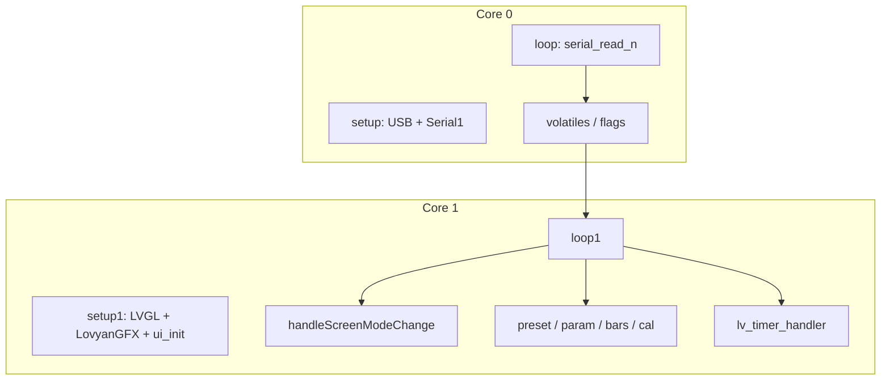

# Screen — UI modes and serial pipeline

How UART traffic becomes LVGL updates on this sketch.

---

## Dual-core split

Core0 never touches LVGL. Core1 never reads UART.

---

## ScreenMode (`serialSignal` values)

| Value | Enum | UI behaviour |
|-------|------|----------------|
| 1 | `PresetScroll` | Preset number/name draw |
| 2 | `LoadSaveExit` | Load main screen; hide save panels; back to scroll |
| 3 | `SaveSelectPreset` | Show save panel; destination preset |
| 4 | `SaveSetName` | Show name textarea + cursor |
| 5 | `SaveCompleted` | “Saved” message; return to scroll |
| 6 | `Silent` | Suppress normal bottom/param UI; still update level bars |
| 7 | `CalibrationMenu` | Load calibration screen; tabs |
| 8 | `ManualCalibration` | Show manual cal panel |

Driven by `'s'` frames from Input. Stale comment block in `Serial.h` is **outdated** — trust `ScreenMode` in the main `.ino`.

---

## Serial1 (Input → Screen)

Only peer link (RX GP13, TX GP12, 2.5 Mbaud). The Screen never transmits on it: **GP12 is physically unconnected**, since the Input board never reads from the Screen. This link is receive-only, fed by the Input's `Serial2` TX (GP4).

| Cmd | Role |
|-----|------|
| `'a'` / `'b'` | ADSR1/2 raw blocks **LE** → bar model + flags |
| `'p'` / `'w'` / `'x'` | ParamId → `setDisplayParam` / levels / cal. `'p'` = 3 B LE; `'w'` = 2 B; `'x'` = 5 B LE. Gap (`PARAM_GAP_FROM_DCO` 154) arrives as slim `'x'` relayed by Input |
| `'y'` | Nav `[id][u8]` → `updateParameters` (cal stage/offset) |
| `'q'` | Preset scroll: number + **16** chars (17-byte payload, no finish) |
| `'s'` | Mode signal → `serialSignal` + `signalFlag` |
| `'c'` | Char index for name edit |

Exact lengths: constants at top of `Serial.ino`. Core0 drains every `loop()` via `serial_parser_drain` (budget 64).

---

## UI update helpers (`loop1`)

| Helper | When |
|--------|------|
| `handleScreenModeChange` | `signalFlag` — load screens / show-hide panels |
| `updateBottomMessageAndPresetUI` | Modes ≤5 — preset scroll, param toast, cursor |
| `updateLevelBars` | `levelBarFlag` — OSC1/OSC2/SUB bars |
| `updateADSRBars` | ADSR1/2 flags — envelope bars |
| `updateCalibrationUI` | Modes 7–8 — tabs / `drawManualCalibration` |

Widgets come from external SquareLine `ui.h` (`ui_Main`, `ui_MANUALCALIBRATION`, bars, labels, textarea, …).

---

## Param display path

1. Serial decode → `paramNumber` / `paramValue` / flags  
2. `setDisplayParam()` maps ParamId → label string + `applyParamToModelAndSignals()` (levels, cal flags)  
3. Core1 `draw_param_1()` / bars / cal redraw  

`parameters.ino` `updateParameters` handles Input `'y'` navigation (manual cal stage/offset) separately from the main `'p'/'w'/'x'` path.
