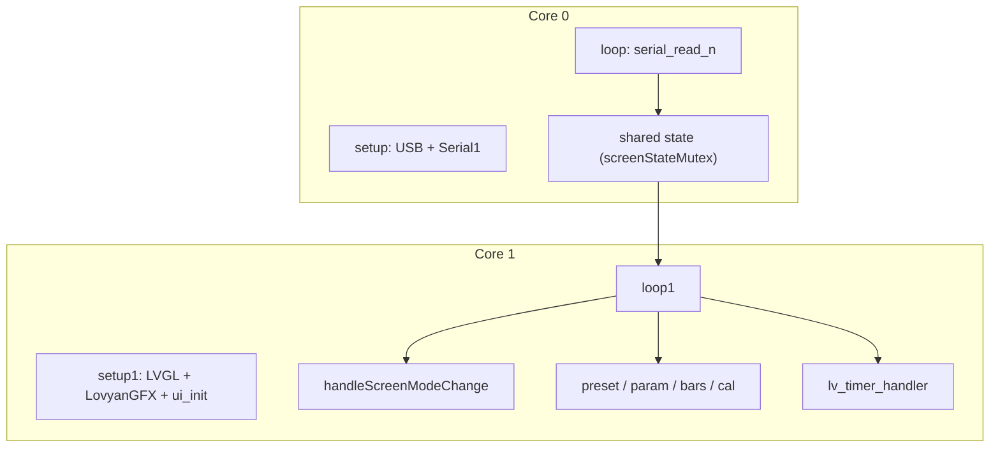
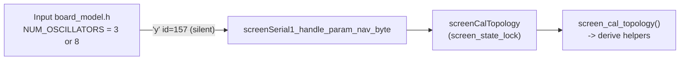

# Screen — UI modes and serial pipeline

How UART traffic becomes LVGL updates on this sketch.

---

## Dual-core split



Core0 never touches LVGL. Core1 never reads UART. All fields either core reads/writes are guarded by `screenStateMutex` (`screen_state_lock()`/`screen_state_unlock()` in `Serial.h`); the lock is always released before calling into LVGL.

---

## ScreenMode (`serialSignal` values)

`enum class ScreenMode : uint8_t` lives in `screen_mode.h` (shared by `Serial.h`, `displayParams.h`, and the main `.ino`).

| Value | Enum | UI behaviour |
|-------|------|----------------|
| 1 | `PresetScroll` | Preset number/name draw |
| 2 | `LoadSaveExit` | Load main screen; hide save panels; back to scroll |
| 3 | `SaveSelectPreset` | Show save panel; destination preset |
| 4 | `SaveSetName` | Show name textarea + cursor |
| 5 | `SaveCompleted` | "Saved" message; return to scroll |
| 6 | `Silent` | Suppress normal bottom/param UI; still update level bars |
| 7 | `CalibrationMenu` | Load calibration screen; tabs |
| 8 | `ManualCalibration` | Show manual cal panel |

Driven by `'s'` frames from Input, and by a handful of `apply_param_*` side effects (calibration flags) that also write `serialSignal` + `signalFlag`. **Core0 is the sole writer of `serialSignal`.** Core1 never writes it back — it keeps a local `currentMode` (static in the main `.ino`) that `handleScreenModeChange()` latches from `serialSignal` each time `signalFlag` is set, atomically under the lock. This avoids the previous bug where Core1's own `LoadSaveExit`/`SaveCompleted` → `PresetScroll` transitions could race with a new signal arriving from Core0.

---

## Serial1 (Input → Screen)

Only peer link (RX GP13, TX GP12, 2.5 Mbaud). The Screen never transmits on it: **GP12 is physically unconnected**, since the Input board never reads from the Screen. This link is receive-only, fed by the Input's `Serial2` TX (GP4).

| Cmd | Role |
|-----|------|
| `'a'` / `'b'` | ADSR1/2 raw blocks **LE** → bar model + flags |
| `'p'` / `'w'` / `'x'` | ParamId → `setDisplayParam` / levels / cal. `'p'` = 3 B LE; `'w'` = 2 B; `'x'` = 5 B LE. Gap (`PARAM_GAP_FROM_DCO` 154) arrives as slim `'x'` relayed by Input |
| `'y'` | Nav `[id][u8]` → `applyNavParam` for cal stage/offset (same router table as `'p'/'w'/'x'`); ids 150..155 also raise `paramChangeFlag` |
| `'q'` | Preset scroll: number + **16** chars (17-byte payload, no finish) |
| `'s'` | Mode signal → `serialSignal` + `signalFlag` |
| `'c'` | Char index for name edit (clamped to 0..15 before use) |

Exact lengths: constants at top of `Serial.ino`. Core0 drains every `loop()` via `serial_parser_drain` (budget 64). Every handler takes `screen_state_lock()` before touching shared state (multi-field updates — e.g. ADSR block, preset number + 16 name bytes — are published as one atomic unit) and releases it before returning.

---

## Cross-core state (`screenStateMutex`)

- Defined in `Serial.ino` as `mutex_t screenStateMutex __attribute__((section(".mutex_array")))` — the pico-sdk runtime calls `mutex_init()` on everything in that section before either core starts running sketch code, so there's no `setup()`/`setup1()` ordering hazard.
- **Core0 rule:** each serial handler takes the lock once, updates all the fields for that frame plus its flag, then releases.
- **Core1 rule:** each `loop1` helper takes the lock once, snapshots/clears the fields+flags it needs into locals, releases the lock, and only then calls LVGL (`lv_label_set_text`, `lv_bar_set_value`, …). The lock is never held across an LVGL call.
- `paramName` is a `const char* volatile` that always points at a string literal set inside `setDisplayParam()` — there is no heap-backed `String` shared between cores, so there's no use-after-free risk if a new param frame arrives mid-read on Core1.
- `levelBarFlag` is a bitmask (`LEVEL_BAR_OSC1`/`OSC2`/`SUB` in `displayParams.h`), not a single last-writer-wins value, so simultaneous level changes between two `loop1` iterations are all delivered.

---

## UI update helpers (`loop1`)

| Helper | When |
|--------|------|
| `handleScreenModeChange` | Consumes `signalFlag` + `serialSignal` atomically, latches Core1-local `currentMode` — load screens / show-hide panels |
| `updateBottomMessageAndPresetUI` | `mode <= SaveCompleted` — preset scroll, param toast, cursor |
| `updateLevelBars` | `levelBarFlag` bitmask — OSC1/OSC2/SUB bars |
| `updateADSRBars` | ADSR1/2 flags — envelope bars |
| `updateCalibrationUI` | `CalibrationMenu`/`ManualCalibration` — tabs / `drawManualCalibration`, flag-driven (only redraws on a param change, not every loop) |

Widgets come from external SquareLine `ui.h` (`ui_Main`, `ui_MANUALCALIBRATION`, bars, labels, textarea, …).

---

## Param display path

1. Serial decode → `paramNumber` / `paramValue` / flags, published under the lock
2. `setDisplayParam()` maps ParamId → label string (`paramName`, a string literal pointer) + `applyParamToModelAndSignals()` (levels, cal flags) — runs on Core0 with the lock held
3. Core1 `draw_param_1()` / bars / cal redraw — snapshots the fields under the lock, releases it, then calls LVGL

The `'y'` nav path (`screenSerial1_handle_param_nav_byte`) routes manual-calibration stage/offset through `applyNavParam()`, which calls the **same** `screenParamTable` router used by `'p'/'w'/'x'` — there is no separate duplicated clamp/derive logic anymore.

---

## Voice topology (`screen_target.h`)

This sketch is meant to be the single screen firmware for both synths, so the places where the two boards disagree are isolated in `screen_target.h` rather than forked per project. The manual-calibration screen is the only UI that genuinely differs:

| | `Monosynth3Osc` (DCO3) | `Voices4x2` (DCO4-REBORN) |
|---|---|---|
| Stage range | 0–5 (3 osc × 2 waveform stages) | 0–7 (8 osc × 1 stage) |
| `ui_oscillatorN` | `stage / 2` | `stage` |
| `ui_waveform` | SAW / TRI / SQR | DCO chip A / B |
| `PARAM_ADSR3_TO_OSC_SELECT` | OSC1 / OSC2 / BOTH / OSC3 / ALL | A / B / A+B |

Every caller reads `screen_cal_topology()` and passes the result to a derive helper. **Do not add a per-project `#if` anywhere else** — add a helper here instead, otherwise the two projects cannot share one commit.

### How the value gets set

The Input controller (shared codebase; see `board_model.h` there) announces its `NUM_OSCILLATORS` (3 or 8) over the existing `'y'` link as `PARAM_UI_VOICE_TOPOLOGY` (157) — once at boot right after opening the screen UART, and again on manual-calibration entry as a belt-and-suspenders re-announce. `screenSerial1_handle_param_nav_byte` (`Serial.ino`) routes it into `screenCalTopology` (`displayParams.ino`, guarded by `screen_state_lock()` like every other cross-core field) via `screen_topology_from_osc_count()`. 157 sits outside the 150–155 range that raises `paramChangeFlag`, so it never produces a toast or redraw — it's a pure background state update. `screen_cal_topology()` reads `screenCalTopology` directly; `SCREEN_CAL_TOPOLOGY_DEFAULT` only supplies its initial value for the brief window before the first announcement lands.



Any Core1 code that reads `screen_cal_topology()` outside an already-held lock must snapshot it under `screen_state_lock()` first, same as any other shared field — see `drawManualCalibration` for the pattern (it snapshots `topology` alongside `stage`/`offset`/`gap`, then calls the derive helpers after unlocking).

---

## SRAM pinning (`sram_hot.h`)

Both cores fetch instructions through the RP2040's single XIP flash bus and its 16 KB cache. A Core0 cache miss stalls the same bus Core1 uses to fetch LVGL's render loops, so pinning Core0's parser into SRAM (`.time_critical`, copied from flash at boot) buys Core1 speed too — see [`DCO/docs/MEMORY.md`](../../../DCO/docs/MEMORY.md) for the general theory (heap vs. static-RAM tax, the callee rule, the dump/A-B procedure) instead of repeating it here.

`sram_hot.h` defines one master switch and a wrapper macro:

```cpp
#ifndef SCREEN_SRAM_HOT
#define SCREEN_SRAM_HOT 1
#endif
#define SCREEN_HOT(fn) __not_in_flash_func(fn)   // no-op when SCREEN_SRAM_HOT=0
```

Override at compile time with `-DSCREEN_SRAM_HOT=0` to A/B every pin at once (`arduino-cli compile --build-property "compiler.cpp.extra_flags=-DSCREEN_SRAM_HOT=0"`).

**Pinned (Core1 render path, main `.ino`):** `my_disp_flush`, `my_tick_get_cb`, `loop1` and its five `static` poll helpers (`handleScreenModeChange`, `updateBottomMessageAndPresetUI`, `updateLevelBars`, `updateADSRBars`, `updateCalibrationUI`) — the helpers get inlined into `loop1` by GCC regardless, confirmed in the `.elf` (`loop1` alone accounts for 1264 of the pinned bytes below).

**Pinned (Core0 parse path, `Serial.ino`):** `serial_read_n` (drags the whole `static inline` chain in `serial_parser.h` along with it), all nine `screenSerial1_handle_*` handlers, and the shared `screenSerial1_apply_param_from_frame` helper — required because handlers are reached through a function pointer (`screenSerial1Commands[]`), so an unpinned callee still XIP-misses even when the caller is in RAM.

**Deliberately left in flash:** `setDisplayParam()`, `draw_param_1()`, `draw_preset_scroll_1()`, `drawManualCalibration()`, `applyNavParam()` / `param_router_apply`, `init_screen_serial()`. All are event-rate (human interaction) or large switches; pinning them would spend SRAM for no measurable gain. `screenSerial1_apply_param_from_frame` calls `setDisplayParam()` while pinned, which is an intentional flash call from a RAM function at the boundary the plan drew.

**Measured cost** (`arduino-cli compile --fqbn rp2040:rp2040:rpipico`, `arm-none-eabi-nm -sW` against the resulting `.elf`; this toolchain places `.time_critical` inside the same boot-copied output section as `.data`, so pinned functions show up as `FUNC` symbols in the `0x20000000` range rather than under a section literally named `.time_critical`):

| Build | Global (static) RAM | Flash |
|-------|---------------------|-------|
| `SCREEN_SRAM_HOT=0` | 60,428 B (23%) | 875,804 B (41%) |
| `SCREEN_SRAM_HOT=1` | 63,324 B (24%) | 873,396 B (41%) |

Net cost: **+2,896 B** of static RAM (~1.4% of the ~201 KB heap budget), well under the ~120 KB the DCO board runs at. About 2.4 KB of that is the pinned function bodies themselves (`loop1` 1264 B including its inlined helpers, `serial_read_n` 252 B, `my_disp_flush` 340 B, the nine handlers + shared helper 476 B combined, `my_tick_get_cb` 8 B); the remainder is linker-inserted branch veneers for RAM↔flash calls crossing the Thumb branch-range limit (e.g. a pinned handler calling `lv_bar_set_value` or `itoa` in flash) — expect a handful of extra veneers per newly pinned call site that reaches into flash.

**What pinning cannot fix:** `Panel_ILI9488::setColorDepth_impl` forces `rgb888_3Byte` whenever the bus is SPI, and `cfg.freq_write = 80000000` in sketch `LGFX_RP2040_FELA.hpp` clamps to the RP2040's ~62.5 MHz SPI ceiling — a full 480×320 redraw is dominated by roughly 59 ms of wire time that no amount of SRAM pinning touches. Pinning pays off on partial redraws and cross-core bus contention, not full-screen flushes.

**FPS/CPU overlay:** Toggle with `SCREEN_PERF_MONITOR` at the top of the main `.ino` (default **1**). Set to **0** for shipping — `setup1()` then calls `lv_sysmon_hide_performance` + `lv_sysmon_performance_pause` (LVGL auto-shows the label on `lv_display_create`). `LV_USE_PERF_MONITOR` stays **1** in `libraries/lv_conf.h` so those APIs exist. `LV_USE_MEM_MONITOR` stays **0** — it requires `LV_USE_STDLIB_MALLOC = LV_STDLIB_BUILTIN`, and this project uses `LV_STDLIB_CLIB`.
